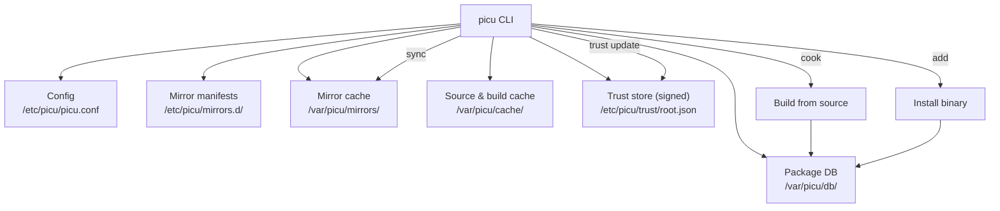
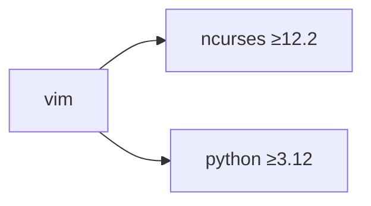

# 🏔️ Summit Linux & `picu`

<p align="center">
  
</p>

> **TL;DR** — An independent **LFS-based distro** with its own package manager, `picu`, which builds from source, installs binaries, verifies mirror signatures, and swears elegantly when you run out of disk space.

<p align="center">
  
</p>
<p align="center">
  
  
  
  
  
  
</p>

---

## 📑 Table of Contents

- [Distro overview](#-distro-overview)
- [Visual identity](#-visual-identity)
- [picu architecture](#-picu-architecture)
- [Security & verification](#-security--verification)
- [Command reference](#-command-reference)
- [CLI output examples](#-cli-output-examples)
- [`.picu` recipe format](#-picu-recipe-format)
- [Roadmap](#️-roadmap)

---

## 🏔️ Distro overview

**Summit Linux** is an independent distribution built from source, following **LFS (Linux From Scratch)** principles. The philosophy: monumental stability, transparency of every component, minimal overhead, and full control over the build.

| Parameter | Value |
|---|:-:|
| 🧱 Base | `LFS` / Source-based |
| 📦 Package manager | `picu` |
| 🎯 Audience | experienced users, sysadmins, hardware-tuning enthusiasts |
| 🚀 Init system | `OpenRC` / `sysvinit` (optionally `runit`) |
| 🖥️ Default environment | minimalist CLI |

<details>
<summary>More on the philosophy</summary>

- Full control over compiler flags
- Nothing is installed "by default" beyond what's necessary
- Transparency — every package ships a declarative build recipe
- Prioritizes build reproducibility over out-of-the-box convenience

</details>

---

## 🎨 Visual identity

> **Logo concept:** a blend of Alpine Linux's heraldic minimalism and MX Linux's strict geometry.

- ⛰️ A stylized, snow-capped mountain peak with sharp, angular facets
- 🔤 The peak is shaped like the letter **S**, tapering into a crystalline spire
- 🎨 Palette: blue · deep blue-violet · snow white — cold stability, precision, and the cleanliness of an LFS build

<p align="center">
  
  
  
</p>

<details>
<summary>Full color palette</summary>

| Color | Hex |
|---|---|
| Snow White | `#ffffff` |
| Light Gray | `#a6b5c2` |
| Deep Blue | `#1e5571` |
| Slate Blue | `#97a7b6` |
| Steel Blue | `#85a1b6` |

</details>

<!-- LOGO PLACEHOLDER — mockups
## Summit


## picu

-->

---

## 🧩 picu architecture

`picu` is the heart of the distro: it manages repositories, builds from source (`cook`), installs binary tarballs (`add`), and verifies mirror integrity and trust.



### 📂 Directory layout

```text
/etc/picu/
├── picu.conf              # main config
├── mirrors.d/              # local mirror manifests
└── trust/
    └── root.json           # Summit release-key-signed list of trusted mirrors + CRL

/var/picu/
├── mirrors/                 # mirror index/data cache
├── db/                      # installed package database
└── cache/                   # source and build artifact cache
```

### ⚙️ Mirror configuration format

Mirrors are described by `.toml`/`.init` manifests under `/var/picu/mirrors/`.

<details>
<summary><code>mirror.toml</code> — mirror config file (remote)</summary>

```toml
[Main]
Name: Summit Linux
Comment: official mirror of Summit Linux
Link: https://repo.summit/mirror.init

[Optional]
Priority: 0 # requested priority; for "Official" status the effective priority
            # comes ONLY from the signed root.json — this field is just a hint
PubKeyFingerprint: SHA256:9f2a4c... # mirror public key fingerprint
Sig: https://repo.summit/mirror.init.sig # DETACHED signature of mirror.init,
                                          # not a "certificate" or root of trust
```

⚠️ `Link`/`Sig` only say _where to download from_, not _why to trust it_. Trust lives separately in `root.json` (see below) and is never derived from fields supplied over the network by the mirror itself.

</details>

<details>
<summary><code>mirror.toml</code> — mirror config file (local)</summary>

```toml
[Main]
Name: Summit Linux
Comment: official mirror of Summit Linux
Path: /etc/picu/mirrors.d/summit

[Optional]
Priority: 0 # requested priority; for "Official" status the effective priority
            # comes ONLY from the signed root.json — this field is just a hint
PubKeyFingerprint: SHA256:9f2a4c... # mirror public key fingerprint
Sig: /etc/picu/mirrors.d/summit/mirror.init.sig # DETACHED signature of mirror.init,
                                          # not a "certificate" or root of trust
```

</details>

<details>
<summary><code>mirror.init</code> — mirror state file</summary>

```toml
[Main]
Size: 12345
ManifestVersion: uint64
UpdateDate: hhmmssDDMMYYYYTZ # tz = timezone -12..+12, example: 120001092028+03
Signature: base64(Ed25519_sign(mirror_privkey, sha256(file_without_this_field)))
SignerKeyID: SHA256:9f2a4c...

[Optional]
Tags: Main, Summit # free-form user-facing tags with no effect on trust.
                    # "Official"/"Verified" are deliberately NOT tags — see below.
```

</details>

---

## 🔐 Security & verification

`picu` automatically verifies repository trust at the binary level. Core principle: **a mirror can never grant itself trusted status** — not via `Tags`, not via any other field it controls. Trust status is computed client-side from data the mirror cannot forge.

### Verification pipeline

1. **🔑 Signature, not just a hash** — `mirror.init` is signed with the mirror's private key (Ed25519). The client downloads the manifest and a separate `.sig`, then verifies the signature against the mirror's public key (`SignerKeyID`).
2. **📜 Root of trust is embedded in the binary, not fetched from a URL** — the list of "official" mirror keys (`root.json`) is signed with the Summit release key, which is **baked into `picu` at build time**. `root.json` is only ever updated via `picu update` / `picu trust update`, which re-checks this signature — never from fields in an arbitrary mirror's `mirror.toml`. This closes the hole where a MITM on the first `sync` could otherwise hand the client its own "root certificate" over an HTTPS link from the config.
3. **🚫 Anti-rollback** — a manifest's `UpdateDate` / version number must increase monotonically relative to the last successfully validated state in `/var/picu/db/`. A signed but stale (potentially previously-compromised) manifest is rejected as a replay attack.
4. **♻️ Key revocation (CRL)** — `root.json` carries a list of revoked `SignerKeyID`s. If an official or community mirror's key is compromised, it's published to the CRL and `picu` stops trusting any manifest signed with that key, even if the signature is still mathematically valid.
5. **🧮 Final mirror status** is a function of (signature validity) × (key present in `root.json`, and at which tier — official/community) × (key not in the CRL). `Tags` from `mirror.init` are purely a display label for the user, never a source of `Official`/`Verified` status.

### Mirror status tiers

| Status | Icon | Description |
|---|:---:|---|
| ✅ Officially verified | `` | Signature valid, key present in `root.json` at the `official` tier, key not in the CRL |
| 💡 Locally modified | `` | Config was locally edited, or the mirror's key was explicitly added to the user's trust list (`picu trust add`) |
| ⚠️ Unsafe | `󰫝` | Signature invalid, key is in the CRL, or the key is unknown and not confirmed by the user |
| 👤 User-added | `` | Key is known and the signature is valid, but the mirror isn't in `root.json` — a third-party community repo with limited trust |

> **Important:** `⚠️` status **blocks installation by default**. It can only be bypassed with an explicit `--allow-unsafe` flag, and even then:
> - a warning with the key fingerprint and rejection reason is logged to the console and to `/var/log/picu/unsafe.log`;
> - `picu` still requires interactive confirmation (`[y/N]`) even if the flag is passed — unless `--yes` is also given.

<p align="center">
  
  
  
  
</p>

> **Note on `Priority`:** `Priority` in `mirror.toml` is only the mirror's own _request_ for how it should be weighted when selecting a source. The effective priority for the `official` tier comes exclusively from the signed `root.json`. Otherwise a community mirror could simply claim `Priority: 0` and outrank an official one — this is explicitly closed off by separating "claimed" priority from "effective" priority.

---

## 📖 Command reference

| # | Command | Purpose |
|:-:|---|---|
| 1 | `picu add <pkg>` | Install a package |
| 2 | `picu cook <pkg>` | Force a from-source build with optimization flags |
| 3 | `picu cut <pkg>` | Safely remove a package and its orphaned dependencies |
| 4 | `picu find <query>` | Search for packages across connected mirrors |
| 5 | `picu sync` | Sync mirrors and prune stale manifests |
| 6 | `picu rebase` | Fully rebuild/reinstall the base LFS system |
| 7 | `picu list` | List locally installed packages |
| 8 | `picu info <pkg\|flag>` | Detailed info about a package or mirror |
| 9 | `picu update` | Update package listings, software, `picu` itself, and the signed `root.json` |
| 10 | `picu trust <list\|add\|revoke>` | Manage trusted mirror keys: view the root trust store, add a community key manually, locally revoke a key |
| 11 | `picu help` | Interactive help |

---

## 💻 CLI output examples

Version color-coding (Nerd Fonts + ANSI):

| Color | Code | Meaning |
|---|:---:|---|
| 🟧 Orange-red | `202` | `outdated` — flagged as outdated by the community and maintainers |
| 🟠 Orange | `208` | `old version` — an older release |
| 🔵 Teal | `50` | `installed version` — currently installed |
| 🟢 Bright green | `46` | `latest version` — current release |

<details>
<summary><code>picu find vim</code></summary>

```console
vim
Comment: Vi improved code editor
Mirror: Summit Official
Versions: 0.1 1.0 13.12 23.12
Type: Src & Bin
```
ver 0.1   (color 202) marked as outdated
ver 1.0   (color 208) old version
ver 23.12 (color 46) latest version
ver 13.12 (color 50) installed version

</details>

<details>
<summary><code>picu add vim</code> (out-of-disk-space case)</summary>

```console
 finding in mirror
 checking version
 update available  23.12
󱞪 install? [Y/n] Y
⣾ installing vim
 not enough disk space to update
```

</details>

<details>
<summary><code>picu add vim</code> (unsafe mirror case)</summary>

```console
 finding in mirror
󰻍 mirror 'shady-mirror' signature invalid / key not in trust store
󰻍 install blocked (unsafe mirror). use --allow-unsafe to override
```

</details>

<details>
<summary><code>picu info -m scr</code></summary>

```console
Name: Summit Community Repository   Has unverified packages
Comment: community packages for Summit Linux
Trust: 󱖨 user tier, key SHA256:7b1e... not in root.json
Last update: 12:41 02/09/2026 (+03)
```

</details>

<details>
<summary><code>picu sync</code></summary>

```console
 fetching https://repo.summit/mirror.init
 verifying signature against trust store... ok
 mirror 'local-custom' modified locally
󰃢 pruning outdated mirrors (>30d)... done
 sync completed successfully
```

</details>

<details>
<summary><code>picu rebase</code></summary>

```console
 rebase will purge and rebuild core LFS packages!
󱞪 are you sure you want to continue? [y/N] y
⣾ [1/42] cooking linux-headers...
⣽ [2/42] cooking glibc...
```

</details>

---

## 📜 `.picu` recipe format

Every package is described by a declarative build script:

```bash
# /var/picu/recipes/app-editors/vim/26.13/recipe.picu
NAME="vim"
VERSION="23.12"
RELEASE="1"
CATEGORY="app-editors"
HOMEPAGE="https://www.vim.org"
SRC_URI="https://github.com/vim/vim/archive/v${VERSION}.tar.gz"
SRC_SHA256="a1b2c3..."   # source hash is verified before unpacking/building

DEPENDS {
    ncurses >= 6.4
    python  >= 3.10 <= 3.14
    lua     = 5.*   # `*` means "any value", but the first digit is pinned to 5;
                     # `*` always resolves to the latest matching component
}

src_cook {
    ./configure \
        --prefix=/usr \
        --with-features=huge \
        --enable-python3interp=dynamic
    make -j$(nproc)
}

src_install {
    make DESTDIR="${PKG_DEST}" install
}

bin_install {
    Deps {
        ncurses:12.2 python:3.12
    }
    Bin: https://repo.summit/vim/26.12/vim-bin
    BinSHA256: d4e5f6...   # binary tarball hash, verified after download, before install
    BinSig: https://repo.summit/vim/26.12/vim-bin.sig  # signed by the same key that signs mirror.init
}
```

<details>
<summary>Recipe dependency graph</summary>



</details>

---

## 🗺️ Roadmap

- [ ] **1. `picu` core binary**
    - [ ] download module
    - [ ] TOML/INI parser
    - [ ] hash validation (source and binaries — `SRC_SHA256`/`BinSHA256`)
- [ ] **2. Cryptography integration**
    - [ ] mirror signature verification via `OpenSSL` / `mbedTLS` (Ed25519)
    - [ ] Summit release key baked into the binary at build time, never fetched at runtime
    - [ ] `root.json` implementation (signed trusted-key list + CRL)
    - [ ] anti-rollback check on manifest `UpdateDate`/version
    - [ ] `picu trust` command (list/add/revoke) for community keys
- [ ] **3. LFS base image**
    - [ ] minimal Summit Linux Stage1 image
- [ ] **4. Official mirror**
    - [ ] repository layout
    - [ ] `mirror.init` files + detached `.sig`
    - [ ] `root.json` publishing and rotation
- [ ] **5. Auto-cleanup system**
    - [ ] `prune_outdated_after` module in `picu sync`
- [ ] **6. Output formatting**
    - [ ] Nerd Fonts integration
    - [ ] ANSI escape codes for version colors
- [ ] **7. Resilience & security testing**
    - [ ] handling `⚠️ not enough disk space to update`
    - [ ] network drops during `sync`/`add`/`cook`
    - [ ] MITM/`root.json` tampering attempts — must be blocked
    - [ ] downgrade/replay of an old signed manifest — must be blocked
    - [ ] install from an `⚠️` mirror without `--allow-unsafe` — must be blocked

<p align="center">
  
</p>

---

> Transparency over magic, a recipe over a black box.
